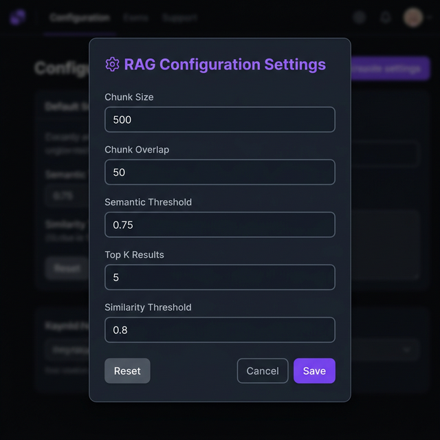

# RAG Frontend

A **React + TypeScript** chat interface for a Retrieval-Augmented Generation (RAG) system.  
Upload documents, ask natural-language questions, and receive AI-generated answers grounded in your content.


---

## Table of Contents

- [Setup Instructions](#setup-instructions)
- [Architecture Overview](#architecture-overview)
- [Retrieval Flow](#retrieval-flow)
- [Third-Party Packages](#third-party-packages)
- [Known Limitations / Future Improvements](#known-limitations--future-improvements)

---

## Setup Instructions

### Prerequisites

| Tool    | Version |
| ------- | ------- |
| Node.js | ≥ 16    |
| npm     | ≥ 8     |

> **Note:** The frontend expects a backend API running at `http://localhost:5000`. Make sure the RAG backend server is up before using the app.

### Installation & Run

```bash
# 1. Clone the repository and navigate to the frontend directory
cd rag-frontend

# 2. Install dependencies
npm install

# 3. Start the development server (opens http://localhost:3000)
npm start
```

### Available Scripts

| Command           | Description                                       |
| ----------------- | ------------------------------------------------- |
| `npm start`       | Runs the app in development mode on port 3000     |
| `npm test`        | Launches the test runner in interactive watch mode |
| `npm run build`   | Creates an optimised production build in `build/`  |

---

## Architecture Overview

The application follows a **component-based architecture** built with Create React App and TypeScript.

```
rag-frontend/
├── public/                    # Static assets (index.html, favicon, etc.)
├── src/
│   ├── components/
│   │   ├── ChatWindow.tsx     # Main chat UI – messages, upload, send
│   │   ├── Sidebar.tsx        # Session list & new-chat button
│   │   └── RagConfigModal.tsx # Modal to tune RAG parameters at runtime
│   ├── services/
│   │   └── api.ts             # Axios HTTP client – all backend API calls
│   ├── App.tsx                # Root component – layout, session management
│   ├── index.tsx              # React DOM entry point
│   ├── index.css              # Global styles & custom animations
│   └── App.css                # App-level styles
├── tailwind.config.js         # TailwindCSS configuration (neon theme)
├── tsconfig.json              # TypeScript compiler options
└── package.json               # Dependencies & scripts
```

### Component Responsibilities

| Component              | Role |
| ---------------------- | ---- |
| **App.tsx**            | Top-level layout. Manages sessions, active session state, and renders Sidebar + ChatWindow. Persists the active session in `localStorage`. |
| **Sidebar.tsx**        | Displays all chat sessions; lets the user create new sessions or delete existing ones. |
| **ChatWindow.tsx**     | Core chat panel – sending messages, receiving bot responses, uploading documents, deleting history, and displaying relevance scores & response times. |
| **RagConfigModal.tsx** | Settings modal to adjust RAG parameters (chunk size, overlap, thresholds, top-K) at runtime. |
| **api.ts**             | Centralised Axios instance (`http://localhost:5000`). Exports functions for every backend endpoint. |

### RAG Settings Modal



Users can fine-tune retrieval parameters at any time via the **⚙ RAG Settings** button without restarting the server.

---


### Step-by-step Detail

1. **Document Upload** – The user clicks **"+ Upload"** in the ChatWindow header. The file is sent via `POST /upload` as multipart form data. On success, the UI displays the filename, upload date, and the total number of chunks generated after embedding.

2. **Asking a Question** – The user types a question and presses **Enter** (or clicks **Send**). The message is appended to the local chat state immediately (optimistic UI), and a request is fired to `POST /query` with the `sessionId` and `question`.

3. **Backend Retrieval + Generation** – The backend embeds the question, retrieves the most relevant document chunks from its vector store (governed by the RAG config parameters), and passes them as context to an LLM to generate an answer. The response includes the `answer` text and a relevance `score`.

4. **Response Display** – The frontend calculates the round-trip response time, then renders the bot's reply bubble showing the answer, score, response time, and timestamp.

5. **RAG Configuration** – Users can open the **⚙ RAG Settings** modal at any time to adjust:
   - **Chunk Size** – number of characters per document chunk
   - **Chunk Overlap** – overlap between consecutive chunks
   - **Semantic Threshold** – minimum semantic similarity score
   - **Top K** – number of chunks to retrieve
   - **Similarity Threshold** – cutoff for vector similarity

---

## Third-Party Packages

### Runtime Dependencies

| Package                         | Why It's Used |
| ------------------------------- | ------------- |
| **react** / **react-dom** (v18) | Core UI library – component rendering, hooks, virtual DOM. |
| **axios** (v1.x)               | Promise-based HTTP client for the backend REST API. Provides interceptors, automatic JSON parsing, and cleaner error handling over native `fetch`. |
| **uuid** (v13)                  | Generates RFC-4122 v4 UUIDs for unique session IDs on the client side. |
| **react-scripts** (v5)         | Create React App toolchain – bundles Webpack, Babel, ESLint, and dev-server config. |
| **web-vitals**                  | Collects Core Web Vitals (LCP, FID, CLS) for performance monitoring. |

### Dev Dependencies

| Package                          | Why It's Used |
| -------------------------------- | ------------- |
| **typescript** (v4.9)            | Static type checking for better DX and fewer runtime bugs. |
| **tailwindcss** (v3.4)           | Utility-first CSS framework with a custom neon/dark theme. |
| **postcss** / **autoprefixer**   | PostCSS pipeline required by TailwindCSS to generate final CSS. |
| **@types/react, react-dom, jest, node** | TypeScript type definitions for React, Jest, and Node.js APIs. |
| **@testing-library/***           | Testing utilities for component-level unit tests. |

---

## Known Limitations / Future Improvements

### Current Limitations

| # | Limitation |
|---|-----------|
| 1 | **Single-document sessions** – Each session supports only one uploaded document; uploading a new file replaces the previous one. |
| 2 | **No authentication** – No user auth/authz; anyone with the URL can use the app. |
| 3 | **Hardcoded backend URL** – `http://localhost:5000` is hardcoded in `api.ts`, making multi-environment deployment cumbersome. |
| 4 | **No streaming responses** – Bot replies arrive only after the full response is generated; no token-by-token streaming. |
| 5 | **Limited error feedback** – Errors surface via `alert()` dialogs instead of inline notifications. |
| 6 | **No markdown rendering** – Bot answers are rendered as plain text; code blocks, lists, etc. are not formatted. |

### Future Improvements

| # | Improvement |
|---|------------|
| 1 | **Environment-based config** – Use `.env` / `REACT_APP_API_URL` for flexible deployments. |
| 2 | **Streaming / SSE** – Stream LLM responses token-by-token for a more responsive UX. |
| 3 | **Multi-document support** – Query across multiple documents in a single session. |
| 4 | **Authentication** – Add OAuth / JWT so sessions are tied to authenticated users. |
| 5 | **Markdown rendering** – Use `react-markdown` to render rich-text bot responses. |
| 6 | **Toast notifications** – Replace `alert()` with a toast system (e.g. `react-hot-toast`). |
| 7 | **Chat history search** – Search across past conversations. |
| 8 | **Theme toggle** – Dark / light mode switcher. |
| 9 | **Mobile-responsive layout** – Better UX on smaller screens and touch devices. |
| 10 | **Typing indicator** – Animated "bot is typing…" while waiting for a response. |
